# Project Name: Time Series Analysis - UK NationalGrid Electricity Demand
## Dataset Used: 
Dataset downloaded from website : http://www.gridwatch.templar.co.uk/

## Project Description
- The goal of this project is to analyze the monthly Electricity Demand in the UK also perform future forecasting. 
- Build a deep learning model to detect the Anomalies in the dataset.

## Project Include:
The purpose of this project consist two parts:
#### Part A. Time Series Analysis and Forecasting using Seasonal Arima Model. 
- Code Accessible At: https://github.com/GDhasade/NationalGrid_Electricity_Demand_TSA/blob/master/TS_Analysis_N_G_Data.ipynb

#### Part B. Anomaly Detection
- Code Accessible At: https://github.com/GDhasade/NationalGrid_Electricity_Demand_TSA/blob/master/Anomaly_Detection.ipynb

### Methods Used
* Data Cleaning & Preparing
* Outlier Detection & Handling
* Data Visualization
* Time Series Analysis
* Time Series Prediction / Forecasting
* Anomaly Detection

### Technologies & Libraries
* Scripting Language: Python
* IDE: Anaconda - Jupyter Notebook
* Data Wrangling: Numpy, Pandas
* Data Visulaization: Matplotlib, plotly - express, graph_objects (interactive graphs)
* Statistical Analysis: statsmodels, scipy
* Dataset libraries/packages: Holiday - holidays.UK()

## Needs of this project
- data exploration
- descriptive statistics
- data processing/cleaning
- statistical modeling
- Time series analysis & forecasting
- Anomaly Detections

## Project Explanation:

## --- Part A. Time Series Analysis and Forecasting using Seasonal Arima Model. ----

## Data Discover:
1. Loading Dataset
* **Dataset 1: National Grid Dataset** 
    - Features used: 
        - **TimeStamp:**  Date from 1/06/2011 to 24/09/2020 (includes daily data with 5 mins of equal interval of time).
        - **Demand:** Sum of Demand recorded by Central Montioring Meters for 5 mins of interval. Actual demand is may higher as those met by embeded technology like small wind turbines and domestic solar panels. (solar power not included)

* **Dataset 2: Library Holiday**
    - Feature used:
        - Date: Date from 1/06/2011 to 24/09/2020 
        - uk_holidays: Consist True boolean value for UK public holiday date.

**2. Data Cleaning:**
- Check Null values
    - Zero null values present in dataset.
- Check duplicate values
    - Found 59 duplicate rows (Added/Repeat because of daylight saving time change).

**3. EDA - Exploratory Data Analysis**
**a. Daily Electricity Demand**

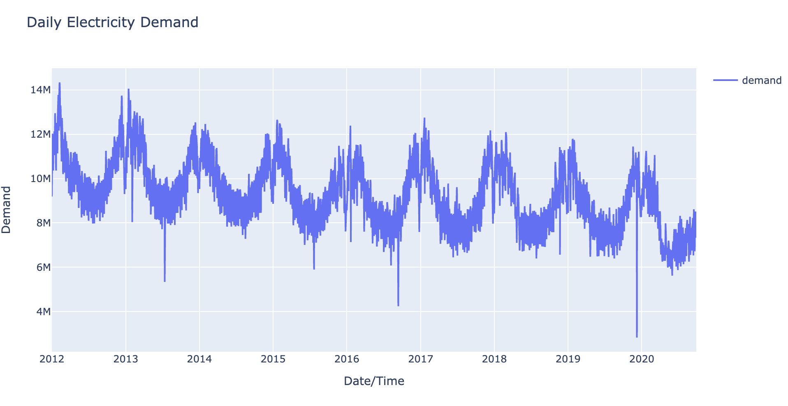

**Analysis:** Found consistent downtrend with constant decrease in magnitude also have seasonal trend too.

**b. Yearly Electricity Demand Trend & Regression Analysis**

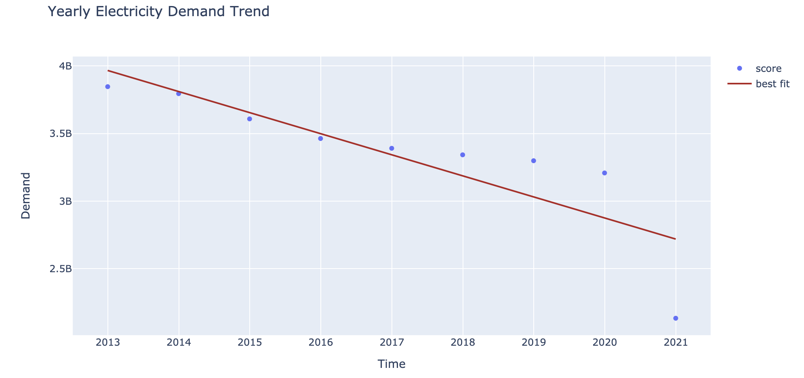
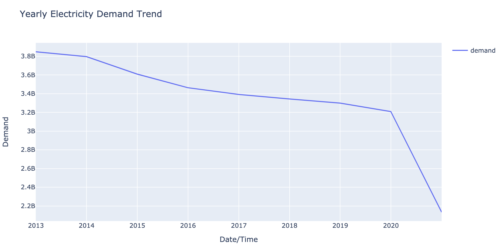

#### Analysis: 
- Trend: 
    - Intially i.e before 2012 till 2014 the electiricity demand trend is constant or higher as compared to current electricity demand.
        - After 2014 observed constant decrease in electricity demand.
        - Reason: Because Uk govt. start promoting other energy sources like domestic & commercial solar panels, smart devices at home and industries, etc.
        - Article (https://www.theguardian.com/business/2018/jan/30/uk-electricity-use-falling-economy-weather) appreciate UK govt and residents as they consume comparitively less electircity than other European countries.
- Regression Line:
    - Regression line shows best fit hence indicate constant downtrend in electricity demand.

**c. Monthly Electricity Demand Trend**

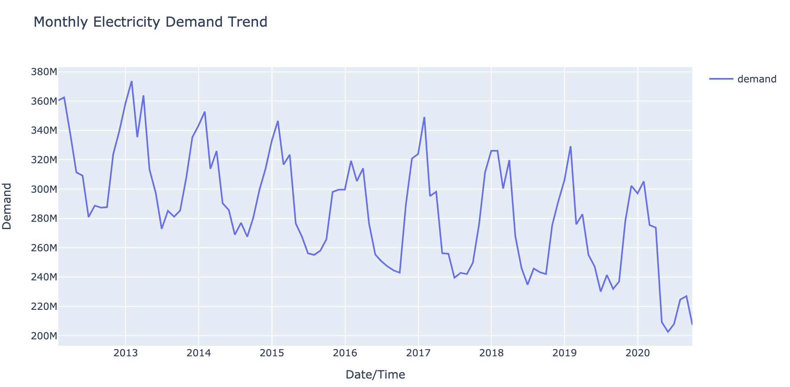
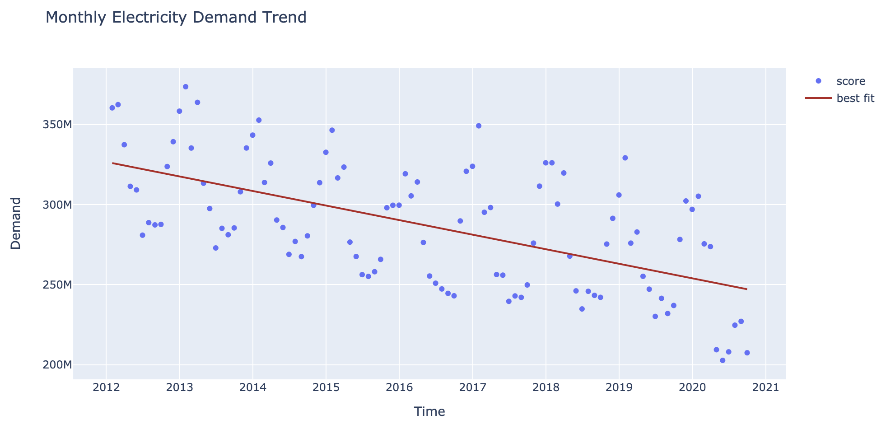

#### Analysis:
- Trend: 
    - Monthly demand helps to identify clear seasonal pattern.
    - As this observation help while decomposing the time series.
    - Data is seasonal with approximately decrease in magnitude demand.
- Regression Line:
    - Shows best fit hence indicate constant downtrend in electricity demand with constant decrease in magnitude.

**d. Daily Trend & Identify steep decrease electricity demand in 2018 & 2019**
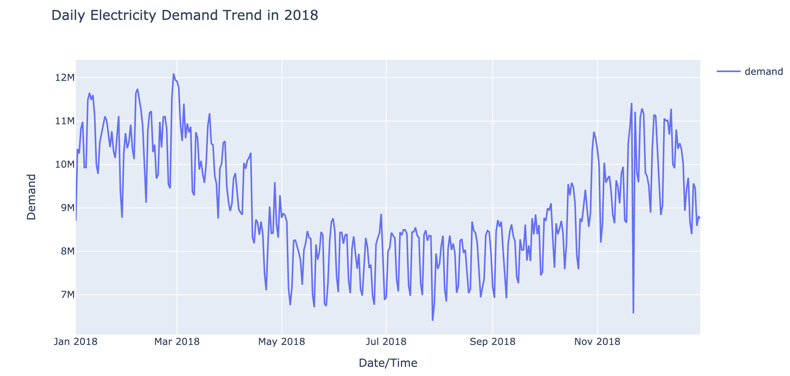
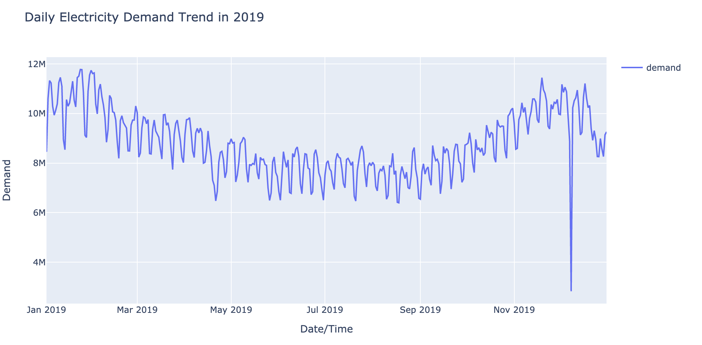

#### Analysis:
- There is an seasonal pattern during the year.
    - **In 2019:**
        - There is an steep decrease on 8th December, 2019.
        - Because there was an storm ATIYA, hence in many areas of uk face power cut for hours.
        - Refrence: https://www.theguardian.com/uk-news/2019/dec/09/uk-weather-britain-battered-by-high-winds-as-storm-atiya-sweeps-in
    - **In 2018:**
        - No news available why electircity demand less on that day.

**e. Weekly Electricity Demand Trend**

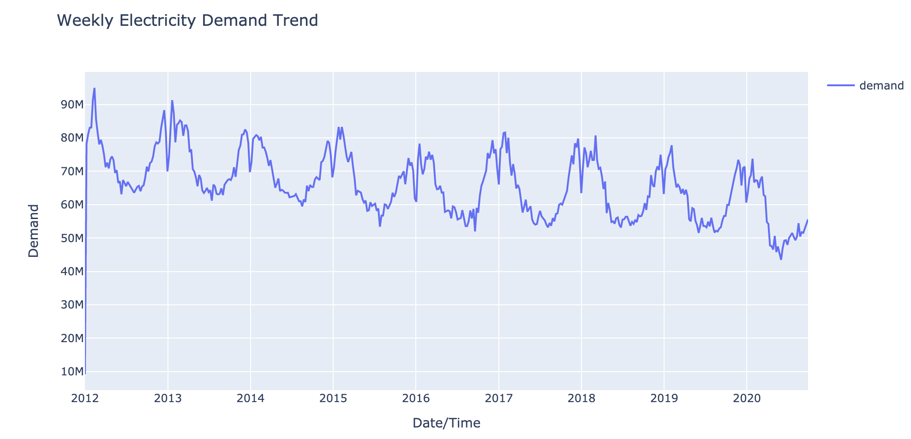
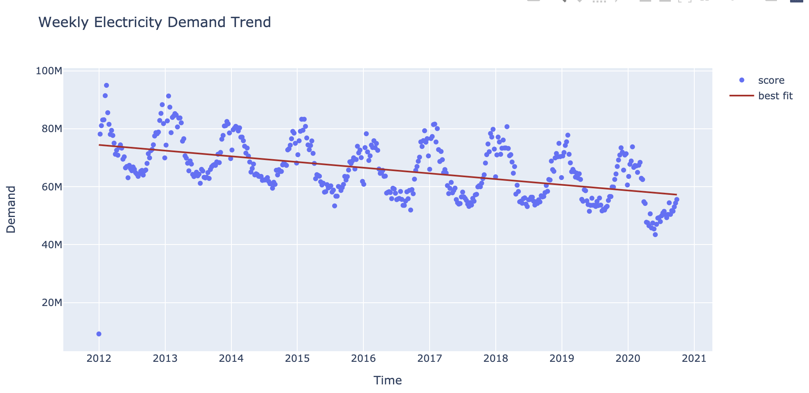

#### Analysis:
- Trend: 
    - Weekly demand visualization shows clear seasonal pattern as well as downtrend.
    - Data is seasonal with approximately decrease in magnitude demand.
- Regression Line:
    - Shows best fit hence indicate constant downtrend in electricity demand with constant decrease in magnitude.

**f. Holiday Impact on Electiricity Demand**

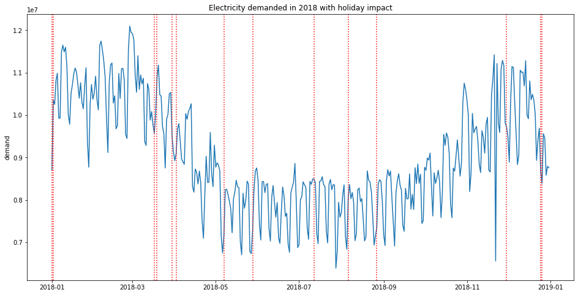
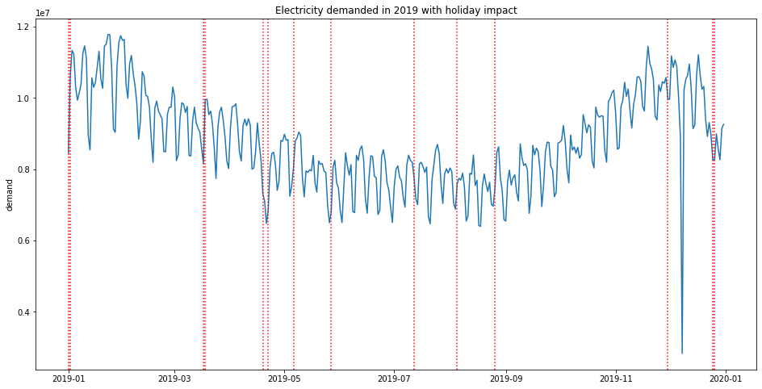

#### Explanation:
- Try to analyse for 2018 and 2019 data
    - In 2018 & 2019:
        - As assumed, during holidays electricity demand has been decreased.
        - It's natural as many offices and manufacturing plants shutoff.
        - Hence electricity demand is less.

### DEVELOP:

#### 1. Data preprocessing -  Outlier Handling**
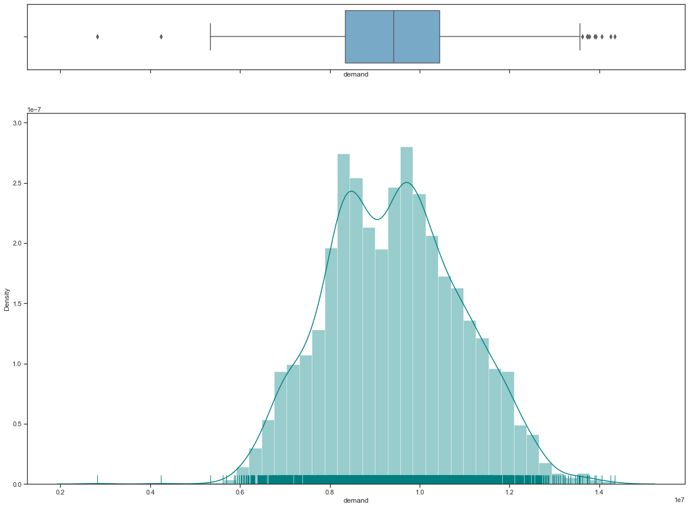

#### Explanation:
- Suspect outliers at both end of box plot.
    - Records Below Lower Quartile:
        - By for records below lower quartile has been imputed/handled by analysing 2 weeks data.
        - Impute with most common/mode value for that outlier.
    - Records Above Upper Quartile:
        - By for records above Upper Quartile has been imputed/handled by analysing 1 Month data.
        - One intresting thing i encounter that, those outlier occured in one month i.e Feb- 2012.
        - Found article: https://www.metoffice.gov.uk/weather/learn-about/weather/case-studies/snow-feb-2012.
        - Stats that during month of feb 2012 there is an historic snowfall observed in UK.
        - Also for the whole month electricity demand is consistent.
        - Hence to adjust or handle this outlier we impute the mean/avg demand in whole month.

#### 2. Statistical Test
- To check data is normally distributed or not using - Shapiro-Wilk Test.

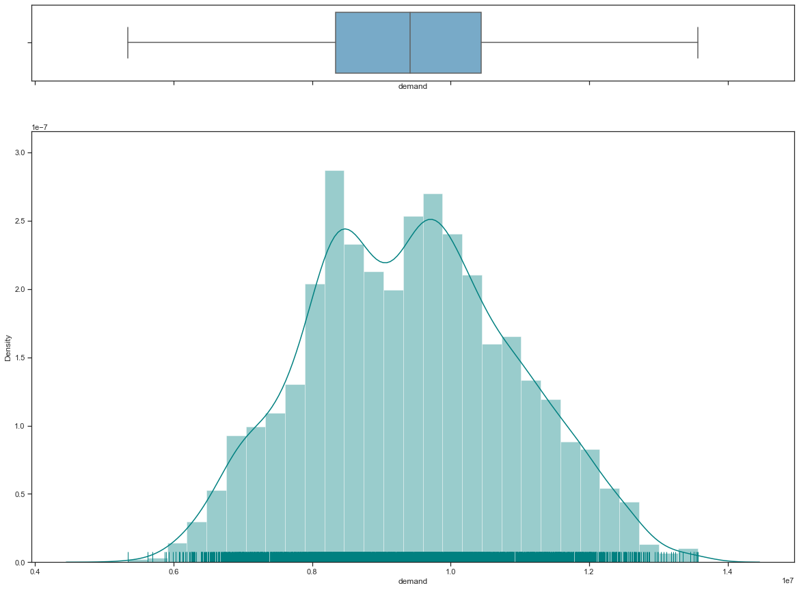

#### 3. TIME SERIES FORECASTING MODEL
Followed below steps:

#### Step 1. Time Series Decomposition plot
- Allow to identify Seasonality-Trend-Error/Remainder.

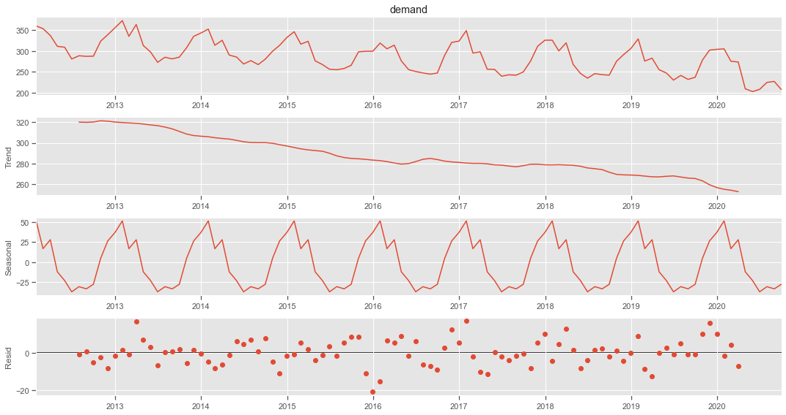

#### Step 2. Determine ARIMA terms
- Check data is stationary or not:
    - Performed Dicky-Fuller statistical test - found data is not stationary.
- To make it stationary:
    - Took 2 time differencing to make data stationary.

#### Stationary Data

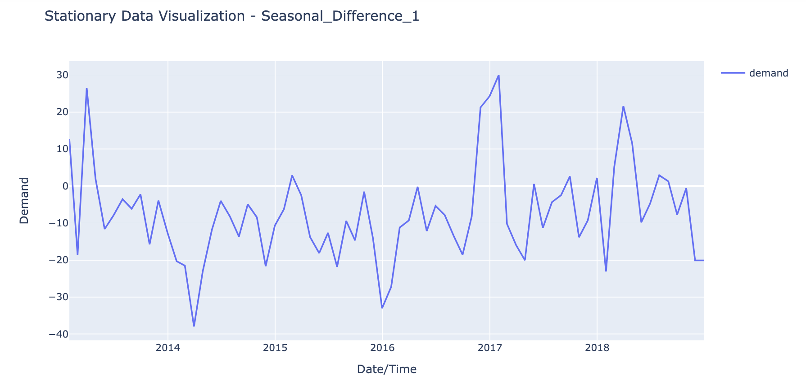
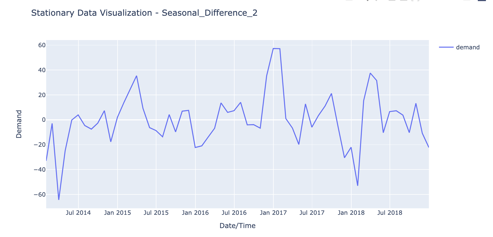

#### Step 3a. Term Identification & Train SARIMA Model
- As our data is seasonal so we have to determine seasonal as well as non seasonal parameters - Inshort, ARIMA (p,d,q) (P,D,Q)m

#### Identify Baseline Model parameters**
- To get baseline parameters impute different set of patterns and identify low best AIC value 
- Results as below: 
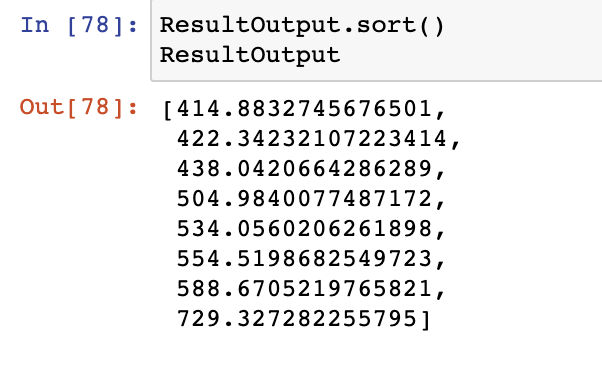

#### Manually or with help of statistical analysis:
- Autocorelation & Partial Autocorelation

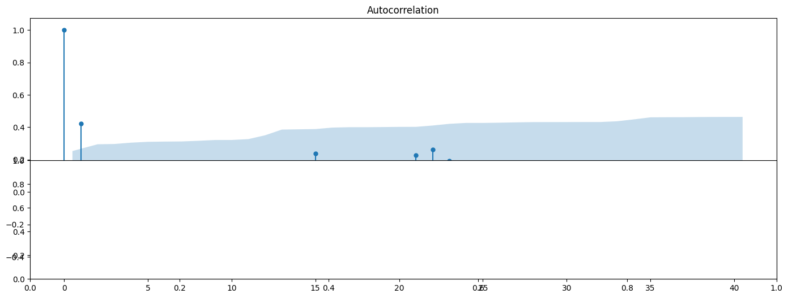
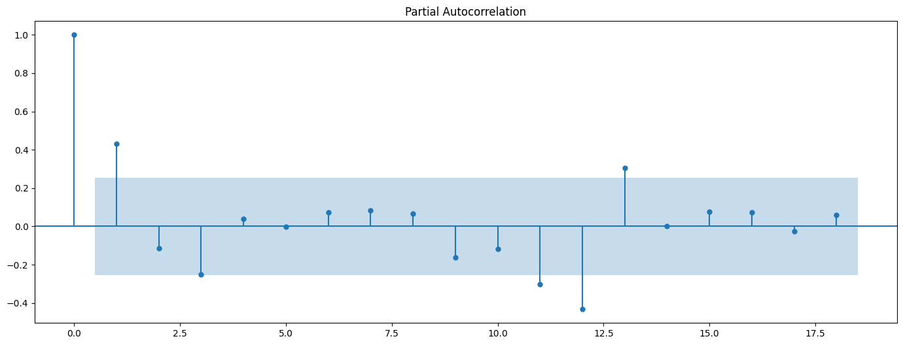

#### Explanation:
- The above plots helps us to identify we have to select AR-K lags or MA
- ACF plot:
    - As it have exponential decrease or lags1 have correlation with previous lag0.
    - Hence, we select AR-K lags model
    - What will be the value of AR (p) and MA (q)
    - As exponential decrease is happen till lag 1.
    - Hence, p, P = 1 and q,Q=0 or 1 (As we are selecting AR model)
    - Final SARIMA parameters:
    - p, P = 1
    - d, D = 1 # Because we take 2 time seasonal differencing to make data stationary
    - q, Q = 0/1
    - m = 12 (as we are considering Monthly seasonal data)
    
  
#### Train SARIMA Model
- Trained with below mention parameters and its AIC result: 
- SARIMA(1, 2, 1)x(1, 2, 1, 12) - AIC:376.4879793804362
- SARIMA(1, 2, 0)x(1, 2, 0, 12) - AIC:416.47908203652696
    - As here when we consider both AR and MA in model we get slightly more good AIC value.
    - Also, the AIC is good than basline model.
    - Hence, final model is SARIMA(1, 2, 1)x(1, 2, 1, 12) - AIC:376.4879793804362
    
#### Final Model Summary

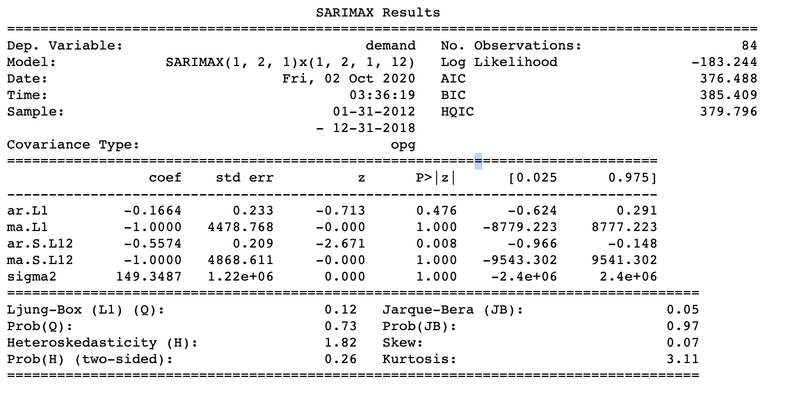

#### Diagonostic plot

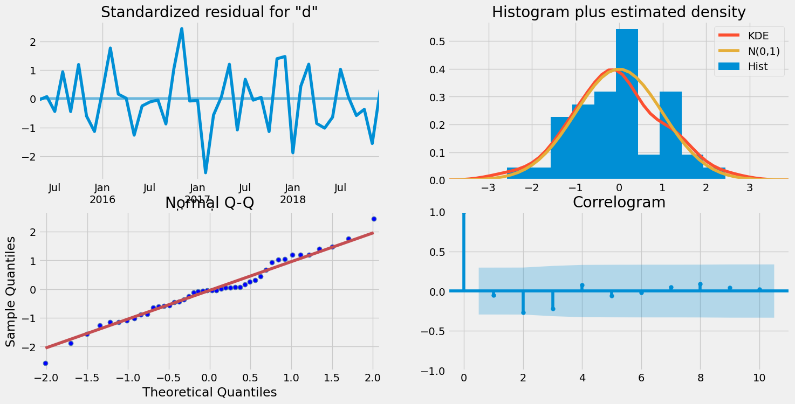

#### Step 3b. Validation SARIMA Model
1. First try to predict results for lower end of train data found below prediction.

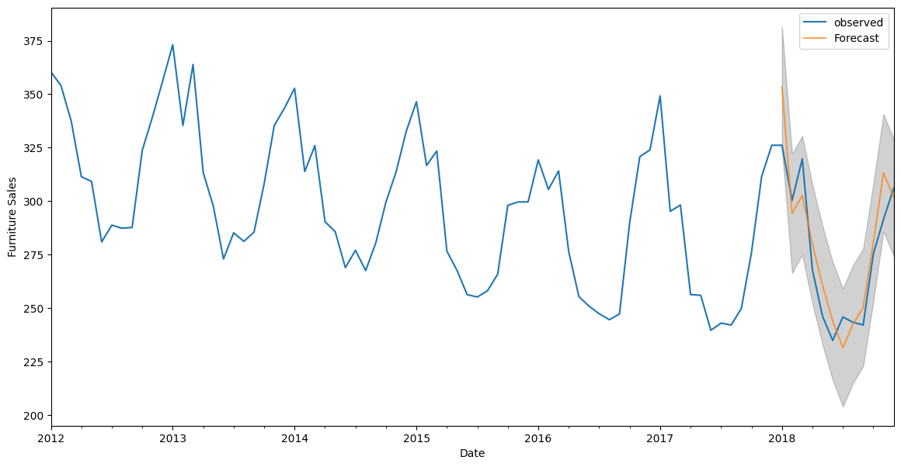

#### Explanation:
    - The line plot is showing the observed/Train values compared to the forecast predictions.
    - Overall, our forecasts align with the true values very well:
    - Showing an downtrend trend starts from the beginning of the year 2018 and
    - After mid of year again as per seasonality move upward in the same direction.
    - Hence our model is forecasing good results

### 2. Calculate Metrics / Results

#### MSE:
- The Mean Squared Error (MSE) of our forecasts is 191.98
    - The mean squared error (MSE) of an estimator measures the average of the squares of the errors i.e., the AVG Squared difference between the estimated values and forecasted/estimated. 
    - The MSE is a measure of the quality of an estimator—it is always non-negative, and the smaller the MSE, the closer we are to finding the line of best fit.

#### RMSE:
- Root Mean Square Error (RMSE) tells us that our model was able to forecast the average daily Electricity Demand in the Train set within 13.86 of the real demand. 
- The daily electricity demand range from around 203 to over 374 GW. 
- Overall this is a pretty good model so far.

## Step 4. Forecasting and Validate with Test data
- Validate Test Data

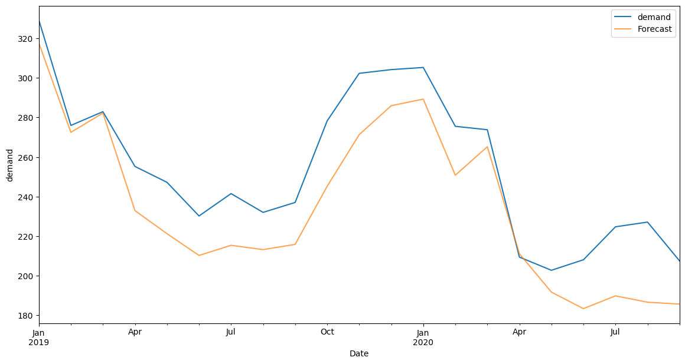

- Validate Test Data along with Future 12 month prediction

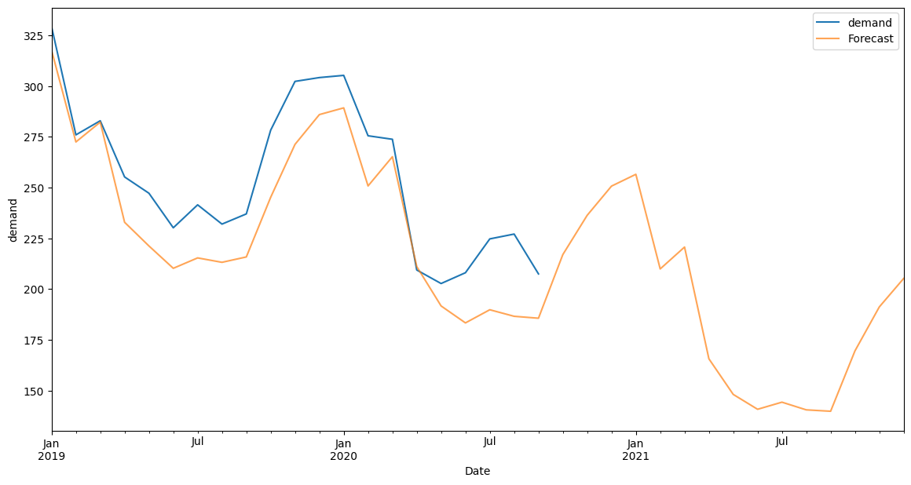

## Part A Conclusion
- Our model clearly captured Electricity demand tend & seasonality.
- As we forecast further out into the future, it follows the original Downtrend as well as seasonality pattern.

## ----------------------- Part B. ANOMALY DETECTION. --------------------------- 

### Description/Introduction:
- The main goal is to detect Anomalies in Time Series. 
- Using Neural Network concept using Tensor Keras - LSTM AutoEncoder Decoder Model.

### Consist Following Steps
#### Step 1. : Import necessary libraries & Data
* **Import All required libraries** 
- Numpy, pandas, matplotlib, plotly, Tensorflow 2.3.1, Keras

* **Dataset: National Grid Dataset** 
- Features used: 
    - **TimeStamp:**  Date from 1/06/2011 to 24/09/2020 (includes daily data with 5 mins of equal interval of time).
    - **Demand:** Sum of Demand recorded by Central Montioring Meters for 5 mins of interval. Actual demand is may higher as those met by embeded technology like small wind turbines and domestic solar panels. (solar power not included)

### Step 2. : Prepare data
- Clean & Transform data same as done above.
- For anomaly detection used daily electricity demand data.

### Step 3. : Data Preprocessing

### Important step in Anomaly detection.
-   Split data into train and test set - 80:20 ratio i.e
    - approximately Train data from 2012 to 2018 &
    - Test Data from 2019 to 2020

### Standardizing our target vector by removing the mean and scaling it to unit variance.
- Scale data between 0 to 1 to minimize the complexity of data .
- Create the instance of StandarsScaler function and then fit this helper function on the training set and then transform the Train and Test set.

### Subsequencing:
- Time series data, we need to create the subsequences before we go to using the data to train our model. 
- We can create sequences with a specific time step in our case 30 (daily data). 
- That means we need to create the sequences with 30 days for the historical data.
- As required by LSTM network, we need to reshape input data as:
    - shape and sample by n time_steps by n features. 
- Here in our case, the n = 1 i.e. one feature.

## Step 4. : Building & Train LSTM Autoencoder Model
### Following steps:
- Here, we are going to build an LSTM Autoencoder network and visualize the architecture and data flow.
- Hence, we are using LSTM autoencoder to detect anomalies.

#### Steps:
    - First, we need to TRAIN the data with no anomalies.
    - Then take new data point and try to reconstruct that using an autoencoder.
    - If the reconstruction error for the new dataset is above some threshold:
    - Then we are going to label that example/data point as an anomaly.
    - In the following 2 lines, we have just assigned values from X_train array i.e. (2524, 30, 1)

#### Model Building Explanation
- Here, we have used the Sequential model from Keras API. Our sample data is 1% which is 2D array and is passed to LSTM as input. The output of the layer is going to be a feature vector of input data.

- LSTM Sequential Encoder Layer Parameters:
    - Created one LSTM layer with the number of cells to be 128.
    - Input shape is equal to no. of time_stpes divided by no. of features.
    - Then we have added the Dropout regularization to 0.2, helps to prevent over-fitting.
    - Since our network is LSTM, we need to duplicate this vector using RepeatVector.
    - Purpose is to just replicate the feature vector from the output of LSTM layer 30 times.
    - LSTM Decoder Layer
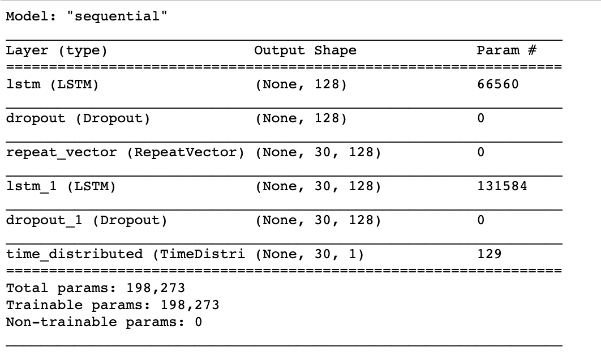

- Now we have mirrored the encoder in reverse fashion i.e. decoder.
- TimeDistributed function creates a Dense Layer with number of nodes equal to the number of features.
- The model is compiled finally using adam optimizer function which is gradient descent optimizer.

## Step 5. : Evaluate LSTM Autoencoder Model
#### Train LSTM model & plot training and validation loss
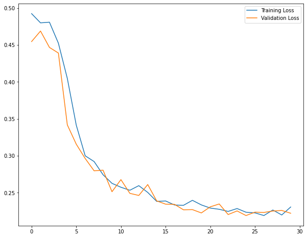

#### To detect anamoly we calculate mean absolute error on Train data & plot
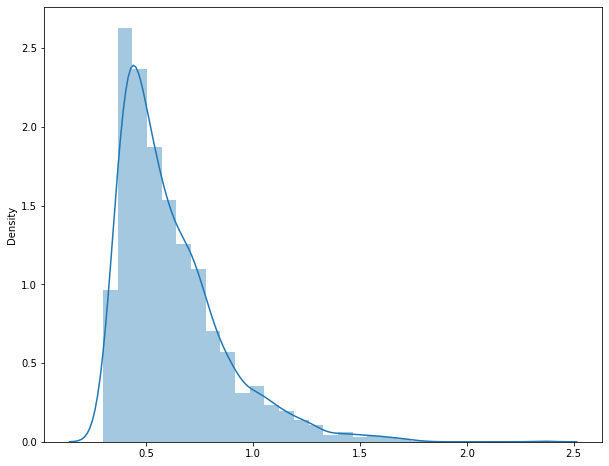

#### To test we calculate mean absolute error on Test data & plot
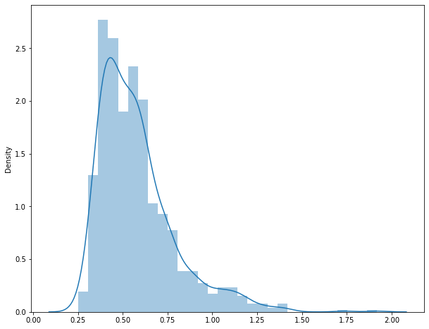

## Step 6. : Detect Anomalies on data
#### Detect Anomaly on Test Data
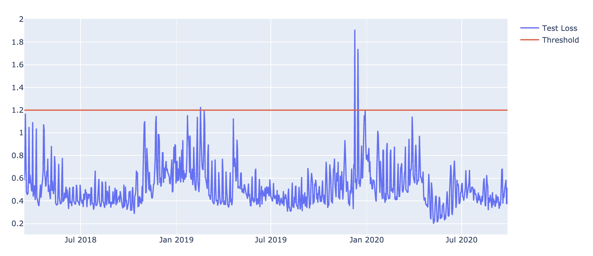

#### Plot Anomaly as marker on Test Data Actual Unscaled Values
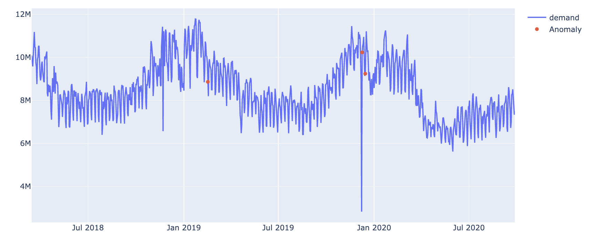

## Part B. Conclusion:
- As we decrease we here anomalies are less because due this pandameic electricity demand is consistently low.
- But still as we reduce the threshold size model able to predict consistent anomalies.
